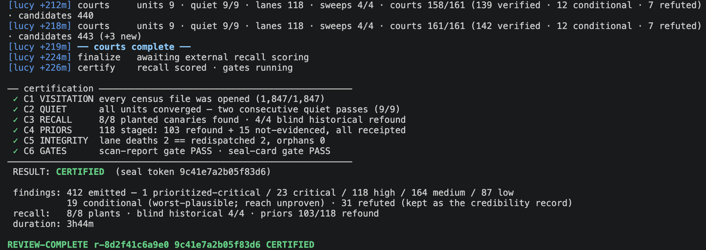

# LUCY


**LUCY is an agentic source-code vulnerability scanning harness for large,
complex applications - recall-first discovery, adversarial verification of
every serious finding, and a certification anyone can re-check from
receipts.**



## Why LUCY

AI can find real vulnerabilities in real code. That is no longer the hard
part. The hard part is trusting the result: did the review read the whole
application, or a convincing sample? Did it stop because nothing was left,
or because it got tired? And when it prints "done," is that a measurement
or just a confident sentence? A missed vulnerability costs far more than a
false alarm, and an AI reviewer adds a failure mode ordinary scanners never
had: fluent, plausible claims of completeness that nothing checks.

LUCY is built around that problem. It looks for everything first - by
default, nothing is capped - and then earns back precision through
[independent courts](docs/certification.md#courts-adversarial-verification) that try to disprove every
serious finding from the code alone. Claims that don't survive are
published as refuted, never silently dropped.

Just as important, LUCY doesn't let the AI grade its own homework. The
file count is computed, not asserted. Detection is tested on every run by
hiding eight synthetic bugs in a disposable copy of your code and checking,
at the end, that the review found them - against an answer key the reviewer
never sees. And a run may print CERTIFIED only when
[deterministic gates](docs/certification.md#the-three-gates) pass on the run's own
receipts. Anyone holding the output can re-run those gates themselves.

LUCY was developed at Fifth Third Bank through its work with frontier AI.
Treat findings as review candidates that your own security process
adjudicates.

## How a scan works

You point LUCY at a [super-repo](docs/super-repo.md): one directory holding
all the code repos that make up your application.

```bash
lucy scan --target <super-repo> --results <dir>
```

1. **Estimate** - prints a cost estimate (no spend yet)
2. **Copy** - copies your code into a disposable workspace (the original is
   never touched)
3. **Plant** - a separate, isolated "planter" hides 8 synthetic bugs in the
   copy; the answer key goes to launcher-only custody - the reviewer can't
   see it
4. **Read** - the selected host splits the code into units and reads each one
   through [four lenses](docs/lenses.md) (auth / secrets / injection / infra),
   up to 20 readers at a time, repeating until passes stop finding new
   problems
5. **Challenge** - independent [court agents](docs/certification.md#courts-adversarial-verification)
   try to DISPROVE every serious finding
6. **Check and seal** - the launcher checks the 8 hidden bugs were found,
   builds the report, runs the
   [certification gates](docs/certification.md#the-three-gates), and bundles
   everything into a ZIP

Everything lands in the results directory you chose; your code is
byte-identical afterward (verified by hash).

Want the full picture with diagrams? See
[how it works, end to end](docs/how-it-works.md).

Deep dives: [building a super-repo](docs/super-repo.md) ·
[the four lenses](docs/lenses.md) ·
[courts, gates, and certification](docs/certification.md) ·
[threat model](docs/threat-model.md)

<!-- SCREENSHOT: live progress output mid-run (legend + a few [lucy +Nm] lines showing lanes/sweeps/courts advancing) -->

## Requirements

- **One review host installed and logged in:**
  - **Claude Code 2.1.245+** (`claude` on PATH, authenticated directly with
    Claude - no Bedrock/Vertex routing). This is the default. Its established
    path uses `/loop`-style autonomy, up to 20 concurrent subagents for
    readers and courts, and Scheduled wakeups.
  - **Codex CLI** (`codex` on PATH, signed in with ChatGPT). Select it with
    `--host codex`. It uses non-interactive, ephemeral `codex exec` lanes and
    does not require Claude Code or an OpenAI API key.
  LUCY checks only the selected host before it copies or plants anything.
- **Python 3.11+**, Git
- **`tree-sitter-language-pack`**, installed with LUCY below. LUCY retains a
  delimiter-based fallback for file types without a grammar, but supported
  languages use tree-sitter to prevent planted mutations from introducing new
  parse errors.
- **Recommended for Codex:** [ripgrep](https://github.com/BurntSushi/ripgrep)
  (`rg` on PATH). LUCY does not require or invoke `rg` directly, but Codex can
  use it for faster repository navigation. Claude operation does not require it.
- **Codex on Linux/WSL2:** `bubblewrap` (`bwrap` on PATH), required by the
  Codex command sandbox. Claude-only operation does not require it.
- **macOS or Linux** (on Windows, run inside WSL2). The launcher's pinned
  command wrappers and the answer-key custody permissions rely on a POSIX
  environment; repositories with Windows line endings are fully supported
  as scan targets from any host.

## Installation

```bash
git clone <this-repo> && cd lucy
python3 -m venv .venv
. .venv/bin/activate
python -m pip install .                 # LUCY + required Python dependencies
./install.sh                            # skill, agents, and lucy CLI (~/.local/bin)
export PATH="$HOME/.local/bin:$PATH"
```

Keep this virtual environment active when running LUCY, or invoke
`.venv/bin/lucy` directly. This avoids modifying an externally managed system
Python environment. `install.sh` validates Python, Git, tree-sitter, and
the presence of at least one review host before writing anything. On Linux it
also requires `bwrap` when Codex is the only installed host; when Claude is
also available, installation can proceed but Codex runs remain blocked until
`bwrap` is installed. A missing `rg` produces only a Codex-performance warning.

On Debian/Ubuntu, the minimal Python installation does not include virtual
environment support. Install it before creating the environment:

```bash
sudo apt-get install python3-venv
python3 -m venv .venv
. .venv/bin/activate
```

For Codex on Debian/Ubuntu or WSL2, install its Linux sandbox prerequisite:

```bash
sudo apt-get install bubblewrap
```

Optional ripgrep installation:

```bash
brew install ripgrep                    # macOS
sudo apt-get install ripgrep            # Debian/Ubuntu
```

To test a checkout without installing it, invoke its launcher wrapper by
path:

```bash
/path/to/lucy/lucy/bin/lucy scan --target ~/code/estate --results ~/lucy-results --estimate-only
```

The wrapper pins imports to that checkout and removes the current directory
from Python's module search path. Do not substitute `python -m` while another
Lucy checkout is the current directory: Python searches that directory first
and can silently run the wrong build.

## Quick start

Price it first - nothing runs, nothing is spent:

```bash
lucy scan --target ~/code/example-super-repo \
  --results ~/lucy-results --estimate-only
```

Then scan:

```bash
lucy scan --target ~/code/example-super-repo \
  --results ~/lucy-results --print
```

That command defaults to Claude. `--host claude` is also accepted. A
Codex-only operator runs:

```bash
lucy scan --host codex \
  --target ~/code/payments-super-repo \
  --results ~/lucy-results --print
```

The canary planter follows the selected host by default. Use `--planter`
only when you intentionally want a different installed host.

The last line printed is the verdict: `REVIEW-COMPLETE <run-id> <token>
CERTIFIED` or `... PROCESS-COMPLETE`. Full walkthrough below.

Two operational notes. First, a real estate takes hours, so keep the
machine awake for the duration (macOS: prefix the command with
`caffeinate -dims`; Linux: `systemd-inhibit --what=sleep <command>`; or
disable system sleep) - a machine that sleeps mid-run kills review lanes,
and you will be resuming instead of reading results. Second, expect
`PROCESS-COMPLETE` on a first pass: certification is usually a
two-command workflow, and `recapture` (Step 5) is the normal second half,
not an error path.

## Usage

An app team's first scan, end to end. You need three things: this tool
installed, a [super-repo](docs/super-repo.md) for your application, and -
optional but worth it - a file of your historical findings.

### Step 1 - build your super-repo

One directory, all the repos that make up the application, checked out side
by side. Include the infrastructure and pipeline repos, not just
application code. See [building a super-repo](docs/super-repo.md) for the
details, including what to leave out.

Optionally commit a `CMDB_ID.txt` at the top level (`APP001 | Example
Application`) and the report will be named `APP001_SCAN_REPORT.json`;
otherwise the directory name is used.

### Step 2 - shape your prior findings (optional, recommended)

Turn historical findings (prior assessment reports, old scanner output, tracker
tickets) into a simple JSON file, one entry per finding; see
[lucy/examples/priors.example.json](lucy/examples/priors.example.json):

```json
{"id": "SEC-EXAMPLE-001", "path": "example-api/src/auth/session.rb", "line": 88,
 "family": "L1-auth", "title": "Session tokens were not invalidated on password change."}
```

`family` is one of the [four lenses](docs/lenses.md): `L1-auth`,
`L2-secrets`, `L3-injection`, `L4-infra`;
paths are relative to the repo (matching tolerates drift). Keep this file
OUTSIDE the super-repo - the launcher refuses one placed inside it. This is
the only manual work in the whole flow. If your source data lacks a lens
field, guessing from the title is fine for pointing readers at weak areas -
but hand-check the family on your most important findings: a few are drawn
as blind refind tests, and a mislabeled family can cost the refind credit
even when the scan finds the defect.

Prior findings buy you three things: a few are held out as blind tests the scan
must rediscover on its own, the rest point the readers at historically weak
areas (turn off with `--cold-priors` if policy forbids it), and every one
comes back answered - REFOUND or NOT-EVIDENCED - which is your
fix-verification evidence.

### Step 3 - price it before spending anything

```bash
lucy scan --target ~/code/example-super-repo \
  --results ~/lucy-results --estimate-only
```

Prints lines of code, unit count, and a dollar range. Nothing runs.

### Step 4 - run the scan

```bash
lucy scan \
  --target  ~/code/example-super-repo \
  --results ~/lucy-results \
  --priors  ~/security/example-priors.json \
  --print
```

By default nothing is capped: the scan keeps going until new passes stop
finding new problems. You can set a budget cap (`--max-budget-usd`), but a
capped run may miss findings and won't certify until you resume or
recapture it - the launcher warns you when a cap is set. A substantial
scan may take hours; use `--estimate-only` for a workload-specific time
and cost range.

The run is unattended but not silent: progress lines print as phases
advance (`[lucy +12m] reading: units 3, lanes 8, sweeps 2, courts 0`). Add
`--log FILE` to also write everything to a file, or `--quiet` to turn the
progress lines off.

### Tip: let an AI coding agent babysit it

A multi-hour scan is nicer with an assistant watching it. Open the
super-repo in an AI coding agent that can run shell commands and ask it to
run the scan for you:

> Run `lucy scan --target . --results ~/lucy-results --priors ~/sec/priors.json
> --print --log ~/lucy-results/scan.log` in the background, watch the results
> directory, give me a progress update every 20 minutes, resume it if it dies,
> and explain the report when it finishes.

You get conversational progress updates, automatic recovery (the agent runs
`--resume` after a crash instead of you learning that command under
pressure), and someone to walk the report with afterward.

Two boundaries to keep straight: the driving agent only operates the `lucy`
CLI - it is not part of the review, and none of the integrity guarantees
depend on it. And don't invoke the `/lucy` skill by hand; it's internal
machinery that only runs inside a launcher-prepared workspace.

### Step 5 - if something interrupts or it falls short

```bash
lucy scan --resume <run-id> --results ~/lucy-results      # crash/network/budget kill
lucy recapture --run <run-id> --results ~/lucy-results    # PROCESS-COMPLETE on coverage
```

Resume picks up where the run left off - completed work is never re-paid.
Recapture re-reads the units that fell short of the coverage bar and
re-seals; it's how an honest PROCESS-COMPLETE becomes CERTIFIED. Reaching
for it is routine, not a failure: some runs require at least one recapture
before they can certify. When the
recall test itself is short (a planted canary unfound), recapture runs a
BOUNDED budget of fully blind full-width laps - the launcher never tells
any model which plant, file, unit, or family was missed - rescoring
silently after each lap and stopping the moment recall cures. A cure is
receipted as CANARY-CURE on the seal card, distinct from a cold find. If
the budget exhausts, the remaining path is operator adjudication
(`--mint-error-slot`, receipted), never an unbounded grind. Before
attesting, `lucy adjudicate --run <run-id> --results ~/lucy-results`
builds a post-verdict evidence brief (plant diffs, findings, court
records, shadow diagnosis) and has a read-only agent judge whether each
missed plant was findable - advisory only; the attestation flag remains
yours to type. The
certification law is cold + cured + mint-error = 8
(see [certification](docs/certification.md)).

### Step 6 - read the results (`~/lucy-results/runs/<run-id>/`)

The last line is the verdict: `REVIEW-COMPLETE <run-id> <token> CERTIFIED`
or `... PROCESS-COMPLETE`. You get the full report either way - CERTIFIED
adds the measured-coverage guarantee
([how certification works](docs/certification.md)).

<!-- SCREENSHOT: FINDINGS.md open in an editor, or the gated report JSON - with any real paths/titles redacted or from a demo super-repo -->

- `<CMDB>_SCAN_REPORT.json` - the authoritative, gate-validated findings
  (`FINDINGS.md` for humans; refuted claims listed separately)
- `receipts/PRIORS_DISPOSITION.json` - every historical finding answered:
  REFOUND (with the new finding id) or NOT-EVIDENCED
- `TRIAL_VERDICT.json` / `CERTIFICATION.json` - recall results,
  target-integrity check, and gate outcomes
- `<run-id>_DELIVERY.zip` - report + seal card + findings + every receipt
- `lucy export runs/<run-id>/<CMDB>_SCAN_REPORT.json` - SARIF for GitHub
  code scanning / DefectDojo

<!-- SCREENSHOT: SARIF results rendered in GitHub code scanning (optional but compelling) -->

### Step 7 - next cycle

After fixing findings, regenerate your prior findings from this run's report
(finding rows map 1:1 to prior-findings entries) and rerun. NOT-EVIDENCED rows on the fresh
code are your fix-verification evidence - retirement happens on receipts,
not assertions.

For the trust architecture see [docs/threat-model.md](docs/threat-model.md).

## FAQ

**Where does my code go?** To the provider selected by `--host`, through
your own Claude Code or Codex CLI login, and nowhere else. Results stay on
your machine in the directory you chose.

**What languages does it support?** The readers are language-agnostic -
they read whatever text is in the repo, including Terraform, Kubernetes,
pipeline definitions, and extensionless scripts identified by a shebang.
The synthetic-bug planting validates syntax
across ~20 common languages and falls back safely elsewhere.

**What does it cost?** Run `--estimate-only` before anything spends. The
Claude estimate includes a dollar range. Saved-login Codex usage is plan- or
credit-based: LUCY receipts tokens and timing after the run, but the Codex
CLI does not expose an authoritative per-run dollar charge. Cost and duration
vary with the size and shape of the application.

**What if it doesn't certify?** You still get the full report. The run ends
PROCESS-COMPLETE with the failing check named, and `resume` or `recapture`
picks up from where it fell short - completed work is never re-paid.

**Do I need both Claude and Codex?** No. Claude remains the default and keeps
its established orchestration path. Codex uses launcher-owned scheduling for
the same units, lenses, courts, convergence receipts, recall scoring, and
certification gates. LUCY preflights only the host you select.

## Security posture (summary)

- Findings never touch the scanned code. The results directory is private
  (0700), but it contains an unredacted working copy and may contain transient
  raw staging data.
- Automatic masking in finalized narrative and report artifacts is best effort
  and limited to recognized credentials, email addresses, and formatted U.S.
  SSNs. Treat results, receipts, logs, delivery archives, and SARIF exports as
  confidential; this is not comprehensive PII anonymization or DLP.
- The reviewer's tool surface is pinned: read-only git, read-only search,
  and the bundled `lucy-*` wrappers. No open-ended shell, no network tools,
  no executables from the scanned repo (enforced by tests).
- Codex needs its normal shell-backed read/search tools; those lanes are
  confined to the disposable workspace with network disabled, while the
  fixed prompt forbids executing target code.
- Bug planting is custodial: a separate no-history process plants,
  mechanical checks accept or reject, and the reviewer sees only a hash
  commitment - never the answer key.
- Serious findings can't be dropped: finalization fails closed on any
  serious row without a court verdict, and the ledger must balance
  (candidates = emitted + refuted).

Report vulnerabilities in LUCY itself privately - see
[SECURITY.md](SECURITY.md).

## Development

```bash
python -m pip install -e '.[dev]'
make check      # unit + e2e pipeline tests, metadata/toolbox checks
```

Public release archives intentionally omit the source-only `.jenkins`
publishing configuration. In those archives, `make check` skips only the
Jenkins archive-policy and deployment-tag assertions; all product, metadata,
and toolbox checks still run. Internal checkouts containing `.jenkins` continue
to validate those publishing controls.

The end-to-end test drives the full pipeline (plant → read → court →
finalize → recall → gates) on a bundled multi-language fixture and asserts
a CERTIFIED outcome under the real gates.

## Contributing

Issues are welcome - bug reports, feature requests, and critiques of the
method (canary design, [capture-recapture](https://en.wikipedia.org/wiki/Mark_and_recapture) assumptions, court verdict rules).
External pull requests are not accepted; see
[CONTRIBUTING.md](CONTRIBUTING.md) for details and what never to post
publicly (your scan findings, receipts, secrets).

## License

[Apache-2.0](LICENSE). Use of this software is subject to the expectations in
our [Responsible Use Policy](ACCEPTABLE_USE.md).

## Codex CLI host

`lucy scan --host codex` uses the locally installed Codex CLI and its saved
ChatGPT login. New Codex runs default to `gpt-5.6-sol` with `high` reasoning;
override them with `--codex-model` and `--codex-reasoning`. Resume,
recapture, and adjudication reuse the host, model, reasoning level, and lane
width recorded at launch unless explicitly overridden.

Each invocation is ephemeral, ignores repository Codex instructions and
project configuration, has no network permission, and receives only the
prepared workspace. Reader and court lanes are read-only; only the isolated
planter receives workspace write permission. Codex timing and token totals
are written to the run receipts. No OpenAI API key is required.
