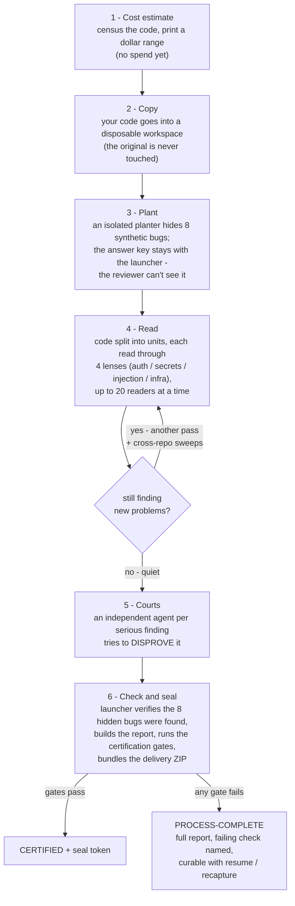
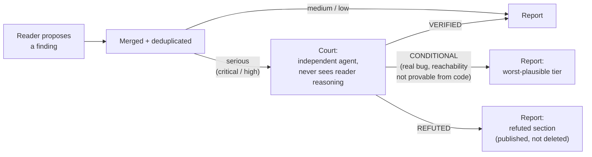
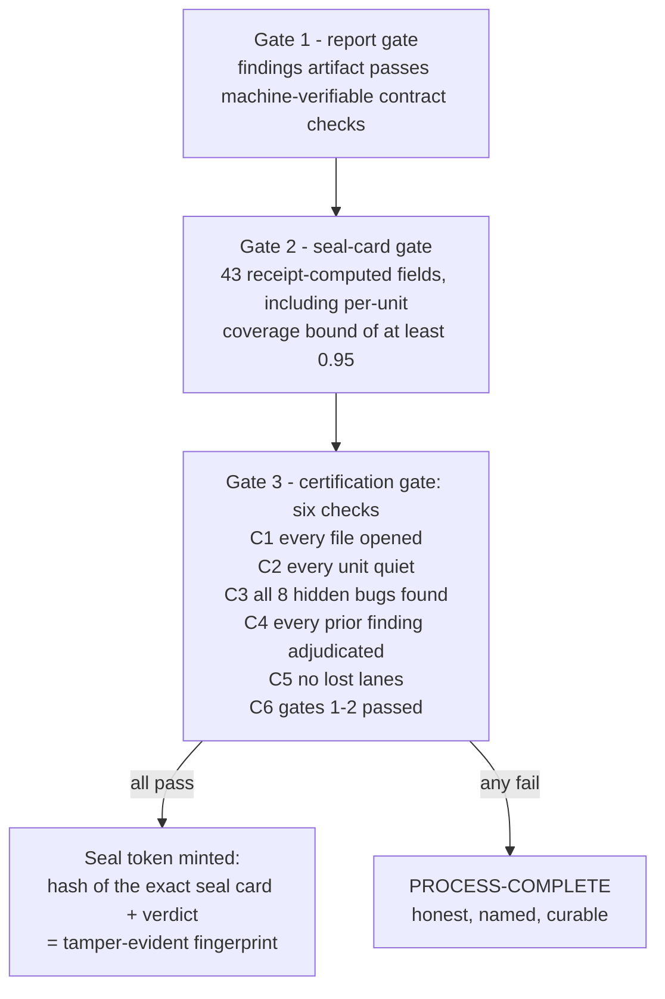

# How a Scan Works, End to End

One page, three diagrams: the pipeline, what happens to a finding, and what
CERTIFIED actually requires.

## The pipeline

Key points that are easy to miss:

- The reviewer never sees the answer key. A separate process plants the
  bugs, the key is held by the launcher, and recall is scored after the
  reviewer exits.
- Reading is not one pass. Lanes repeat until each unit goes quiet, and
  independent passes double as the samples for the coverage estimate below.
- The battery runs first so the AI spends its attention on judgment calls,
  not on things a deterministic check can catch. Battery hits go through
  courts like everything else.

## What happens to a finding

The court asks: does the cited code exist, is it reachable, can an attacker
influence it, does something else block it, does the evidence support the
severity. Three outcomes:

- **VERIFIED** - holds up, reach evidenced.
- **CONDITIONAL** - the bug is real in the code, but exploitation depends on
  something the code alone can't settle (deployment config, network
  reachability). Severity is kept at what it would be IF reachable - an
  unproven precondition never downgrades a finding; only a proven
  compensating control does.
- **REFUTED** - doesn't hold up. Kept in the report as its own section.
  The count must balance: every candidate is either emitted or refuted.

## What CERTIFIED requires

Three deterministic gates run in order, and anyone holding the delivery
ZIP can re-run all three:

The coverage bound comes from [capture-recapture](https://en.wikipedia.org/wiki/Mark_and_recapture), the technique ecologists
use to estimate a fish population: if a second, independent reading pass
mostly rediscovers what the first pass found, most of what's findable has
been found. If it keeps surfacing new things, the review isn't done, and
the number says so.

CERTIFIED does not mean bug-free. It means: every file was opened, reading
continued until it stopped producing, detection was spot-checked against
hidden bugs, every serious claim survived a disproof attempt or was
published as refuted, and all of that is checkable by re-running the gates
yourself.

## Where to go deeper

- [Building a super-repo](super-repo.md)
- [The four lenses](lenses.md)
- [Courts](certification.md#courts-adversarial-verification) and [gates](certification.md#the-three-gates)
- [Threat model](threat-model.md)
